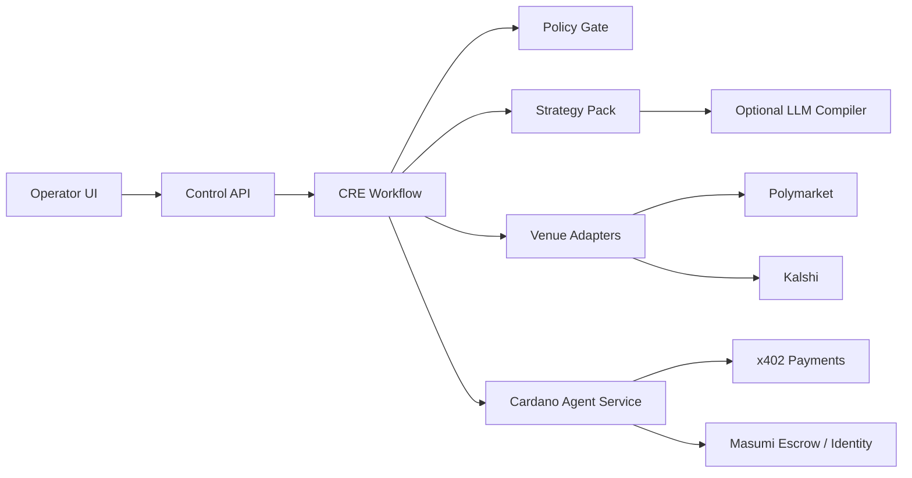

## Product thesis

We build an **agent runtime for prediction-market strategies**.

Humans and institutions do not trade each contract by hand. They **deploy an agent**. The agent holds funds, follows a **policy**, and runs a **strategy pack**. The agent can trade on more than one venue through one control plane.

[River Markets](https://www.rivermarkets.com/) is a prime-brokerage layer for **human** traders. We are the operating layer for **agents**.

**Cardano** is the agent economy layer. The demo uses a local **x402-style** payment envelope. **Masumi** manages agent registration, on-chain funds locking, queued results, disputes, and refunds. See [payment scaffolding](docs/cardano-payments.md) for the verified protocol and current integration limits.

**Chainlink CRE** is the orchestration layer. CRE reads market data, runs the strategy, checks the policy, then calls the venue adapters and the Cardano payment flow.

We do not need to win every bet. We supply the runtime. Users pay for usage and for execution.

---

## Scope (hackathon)

**In scope**
- One agent with a funded demo wallet
- A hard policy shell (limits, allowlists, stop-loss, kill switch)
- One strategy pack plus a thin prompt-to-parameter path
- Two or more venue **read** APIs; one or two venue **write** paths (live or paper, labeled)
- Cardano pay + escrow on the critical path
- One CRE workflow that runs the loop end to end

**Out of scope**
- Full smart order routing like River
- Many strategy packs
- Solana and NOWNodes unless time remains

---

## Architecture

**Data flow (one cycle)**
1. The operator sets policy and selects a strategy pack.
2. CRE starts on a timer or on an event.
3. Venue adapters fetch prices and markets.
4. The strategy pack scores candidates and proposes orders.
5. The policy gate accepts or rejects each proposal.
6. If the agent must buy data or a score API, it pays on Cardano with x402.
7. The venue adapter places a live or paper order.
8. The control API writes the audit log and updates the UI.

---

## Stack

| Layer | Choice | Role |
|---|---|---|
| Operator UI | Next.js (or simple React) | Policy form, pack select, positions, audit log |
| Control API | TypeScript (Node) | Auth, config, demo wallet state, submission glue |
| Orchestration | Chainlink CRE (TypeScript SDK + CLI simulate) | Core loop: fetch → decide → pay → order |
| Agent economy | Cardano + x402 + Masumi | Pay per request, identity, escrow, refunds |
| Strategies | TypeScript modules in-repo | Pack interface: `evaluate(markets, state) → intents` |
| Prompt path | One LLM call (optional) | Maps short text into pack parameters only |
| Venues | Polymarket API + Kalshi API (adapters) | Normalize markets; place or paper-fill |
| Storage | Postgres or SQLite | Policies, runs, orders, audit events |
| Secrets | Env / CRE secrets (TEE only if ready) | Venue keys, agent keys |

**Strategy pack interface (minimum)**
- Inputs: normalized markets, positions, balances
- Outputs: intents `{ venue, market_id, side, size, limit }`
- Always filtered by the policy shell before execution

**Policy shell (minimum fields)**
- `max_bet`
- `max_daily_loss`
- `category_allow` / `category_deny`
- `venues_enabled`
- `stop_loss_pct`
- `kill_switch`

---

## Two microservices

1. **Cardano Agent Service** — wallet/escrow view, x402 pay, Masumi identity, payment receipts  
2. **CRE Strategy Runtime** — orchestration, policy gate, strategy packs, venue adapters  

The UI talks to the control API. The control API does not replace CRE. CRE owns the trading loop.

---

## Demo proof points

- Policy blocks a “politics” market  
- Stop-loss or kill switch stops new orders  
- Agent pays on Cardano before it uses a paid data/score endpoint  
- CRE simulation (or deploy) log shows the full cycle  
- UI shows live vs paper fills clearly  

---

## One-line pitch

**Deploy strategies into agents that pay on Cardano and execute across prediction venues under a hard policy — CRE runs the loop.**
