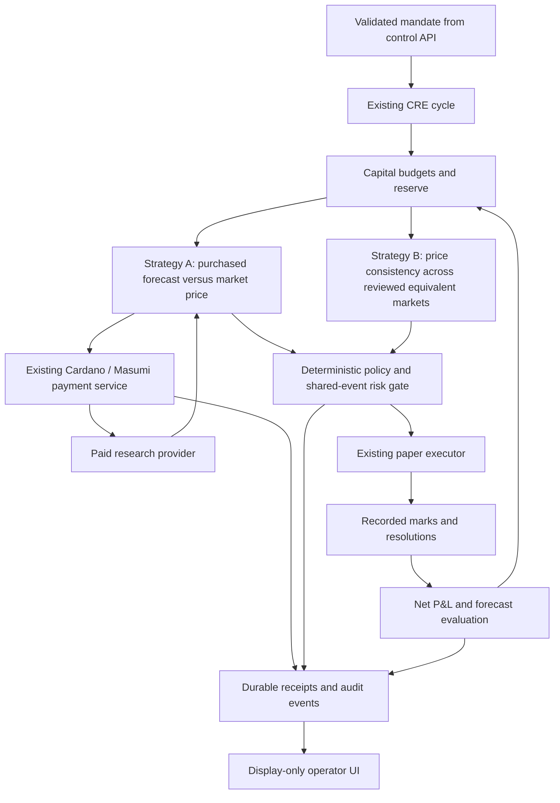

# Plan v2: Capital allocation for prediction-market agents

## Decision

Pursue a capital-allocation layer on top of the existing agent runtime.
Build one complete loop for the hackathon.
Two strategy agents buy research, propose paper positions, pass risk checks,
and receive updated capital budgets after an outcome replay.

Pitch: **A capital market for agents that purchase intelligence and operate
under explicit risk limits.**

This plan replaces the original runtime plan.
It does not claim that the new features exist.
This PR adds a plan only. It does not change the current runtime or policy.

## Current foundation

Reuse the existing TypeScript and Bun services, SQLite store, venue adapters,
paper position lifecycle, payment receipts, and display-only operator UI.
Keep existing routes, exports, idempotency checks, and restart recovery.

The current CRE workflow already runs the agent cycle.
Keep CRE as the orchestration adapter for that cycle.
Implement new allocation and risk rules as deterministic runtime modules.
Do not require a new Chainlink-to-Cardano integration.
CRE calls the existing payment service over HTTP.

Payments currently default to simulation.
The preprod adapters have fixture coverage.
Actual chain settlement has not been tested.
The local X-PAYMENT envelope is x402-style scaffolding.
It is not proof of a standard Cardano x402 payment rail.

Use [payment scaffolding](docs/cardano-payments.md) as the integration baseline.
Do not assume that discovery, reputation, stablecoin payments, completed refunds,
or automatic escrow withdrawal are available.
Verify each required capability against the configured service.

## Hackathon scope

| Build | Minimum result |
| --- | --- |
| Two strategy agents | Different proposal logic; separate budgets, positions, research costs, and performance records |
| Paid research agent | One strategy purchases an input-bound forecast through the existing Cardano/Masumi payment flow |
| Shared-event risk gate | A small reviewed mapping detects overlapping event exposure across markets and venues |
| Meta-allocator | Deterministic capital budgets with reserve, sample requirements, and bounded changes |
| Outcome replay | Recorded prices and resolutions produce paper P&L and forecast scores |
| Operator UI | Shows payment evidence, risk decisions, paper positions, and allocation changes |

Keep the existing venue read adapters.
Use paper execution for all investment orders in this demo.
Cardano research payments use separate preprod funds.
Do not treat paper trading balances as Cardano wallet balances.

Defer real-money deposits, a mandate vault, live trading, cross-chain funding,
a third strategy, general agent discovery, public reputation, and a general
world-state graph.
Use the supported ADA payment path first.
Add standard x402 or stablecoin support only after verification and only if time
or the hackathon track requires it.

## Architecture

A strategy agent is a logical account within the runtime.
It does not need a separate process or wallet for the first version.
The allocator changes budgets. It does not directly submit orders.
The policy gate checks proposals before the paper executor can accept them.

The operator UI reads GET /agent/state and GET /audit.
Configure the mandate through the existing control API or a validated demo
fixture. Do not add policy forms or order controls to the operator UI.

## Component contracts

### Strategy proposals

Extend the existing intent contract through a compatible migration.
Include strategy ID, cycle ID, venue, market ID, side, size, limit price,
forecast probability where applicable, forecast time, and research receipt ID.
Attach reviewed event references before risk checks.
Reject malformed values and stale research.

Strategy A compares a purchased probability estimate with the market price.
Strategy B checks price consistency for explicitly reviewed equivalent markets.
Include fees and spread assumptions in both strategies.
Do not describe a candidate as guaranteed arbitrage.

A research response binds to its requested markets, input hash, and timestamp.
A probability is an estimate. A confidence field is not proof of accuracy.

### Capital allocation

Start with fixed budgets for both strategies and a cash reserve.
Treat each budget as a maximum. Unused capital can stay in cash.

After each replay round:

1. Mark open positions and settle only resolved positions.
2. Attribute trading results and research expenses to each strategy.
3. Evaluate forecasts on resolved events with a proper score, such as Brier score.
4. Apply minimum sample requirements before performance-based budget changes.
5. Move budgets by a bounded amount.
6. Recheck reserve, strategy caps, and existing exposure.

Use net P&L, forecast quality, and drawdown as separate reported measures.
Do not infer statistical correlation from a few demo observations.
Use shared-event limits for the hackathon.

Declare the sample threshold, budget step, caps, and scoring rule in a versioned
configuration. Keep the rule simple enough to explain in the UI.
Show the inputs and reason for each allocation change.
A smaller budget does not close existing positions.
Block new spending when existing exposure exceeds that budget.

Track research costs in ADA.
For net paper P&L, record an explicit replay conversion rate and timestamp.
Show that conversion as an accounting assumption.
Do not imply a transfer between the research wallet and the paper account.

### Shared-event risk

Use a small mapping of venue markets to reviewed event IDs.
Record contract wording, outcome direction, and resolution assumptions.
Different wording can mean different settlement conditions.

For the first version, group positions by shared event.
Sum the capital at risk conservatively across the group.
Do not net positions unless the fixture proves compatible settlement and payoff.
This detects concentration. It does not estimate a complete joint probability model.

Check current positions, pending orders, and the whole proposed batch.
Reserve approved exposure before checking the next proposal.
Reject unknown mappings for markets that require an event limit.

Preserve the existing maximum bet, category rules, daily-loss limits,
stop-loss, available-cash checks, and kill switch.
Add strategy-budget, research-budget, reserve, and shared-event limits.
The kill switch must stop new research payments and new orders.

### Payment boundary

Use the existing request → purchase → confirmation → score → delivery flow.
Reuse receipt IDs, input hashes, and idempotency keys on retries.
Require verified confirmation before consuming the paid response.
A timeout must not cause a second purchase or an unverified score.

Cardano/Masumi can enforce the supported funds-lock relationship.
The application enforces paper portfolio exposure.
Do not claim that a Cardano validator controls external venue positions.

Record funds locking, local response delivery, queued result submission,
withdrawal, and refunds as distinct states.
Show only states supported by observed evidence.
Never label an API acceptance or fixture response as completed settlement.

## Implementation sequence

### 1. Prove the payment integration

Do this before building new UI screens.

- Confirm the Masumi service version and supported payment terms.
- Configure preprod credentials through secret references.
- Confirm buyer funds, registered provider, amount, and seller address.
- Complete one purchase and obtain a confirmed funds-lock transaction.
- Verify the transaction through the Cardano adapter.
- Retrieve the bound forecast and its durable receipt.
- Confirm that retries reuse the purchase and stored response.
- Record the network, transaction ID, confirmation evidence, and result state.

Exit condition: a real preprod payment authorizes a forecast.
Testnet funds have no real investment value.

If credentials or service compatibility block this milestone, keep the offline
demo usable and label payments simulated.
Report the blocked dependency.
A simulated demo does not satisfy the real-payment proof point.
Do not add another payment stack just to conceal the blocker.

### 2. Add strategy accounting

Add strategy IDs and compatible store migrations.
Attribute positions, research receipts, and results to the correct strategy.
Implement two strategies with different logic.
Preserve the existing single-strategy demo routes.

Exit condition: the same snapshot produces inspectable proposals and separate
budgets for both strategies.

### 3. Add shared-event checks

Create a small reviewed fixture with overlapping contracts.
Check proposals against the full current and pending book.
Provide stable reason codes and numeric explanations.

Exit condition: individually acceptable proposals exceed a shared-event cap
when combined, and the gate blocks or reduces the later proposal.

### 4. Add replay and reallocation

Use recorded market snapshots and resolved outcomes.
Keep forecasts fixed before revealing outcomes.
Prevent future information from entering strategy inputs.
Use the existing marks, closes, and resolution paths.

Exit condition: replay produces reproducible paper accounting, forecast scores,
and bounded budget changes. Insufficient samples preserve initial budgets.

### 5. Extend the operator display

Show the full cycle through the existing state and audit read APIs.
Show before-and-after budgets and the reason for each change.
Show the payment mode separately from the paper order mode.

Exit condition: a judge can follow the cycle without reading service logs.

### 6. Rehearse the complete demo

Run the verified preprod payment path and save its evidence.
Prepare an offline replay fallback.
Use a fresh run ID for a new purchase.
Label a reused receipt as historical evidence.

Finish the complete loop before adding extra agents or integrations.

## Demo story

1. Load a mandate with strategy caps, a shared-event cap, and a reserve.
2. Show two strategy budgets.
3. Strategy A purchases a forecast. Show its payment receipt and network.
4. Both strategies propose paper positions on reviewed related markets.
5. Show how their combined exposure exceeds the shared-event cap.
6. Show the risk gate constrain the proposals.
7. Execute approved paper positions.
8. Replay recorded outcomes and deduct attributed research costs.
9. Show forecast scores and bounded allocation changes.
10. Repeat a cycle to show that payment and order retries do not duplicate effects.

Use historical or synthetic events with clear dates.
Label replayed results.
Do not present replay P&L as evidence of live investment performance.

## Acceptance and validation

| Area | Required evidence |
| --- | --- |
| Payment | Confirmed preprod funds lock, verified receipt, and bound response; otherwise an explicit simulated-payment limitation |
| Payment failure | No paid response before confirmation; retries do not buy twice |
| Risk | Combined and existing shared-event exposure cannot exceed the configured limit |
| Accounting | Research expense is attributed once; cash, positions, reserve, and budgets reconcile |
| Reallocation | Insufficient samples cause no performance-based change; changes respect caps and step limits |
| Replay | Outcomes are unavailable to strategies until their recorded resolution time |
| Recovery | Restart and repeated cycle IDs do not duplicate paper fills or purchases |
| UI | Every order says paper; every payment says simulated or preprod; each decision has evidence |

Run meaningful tests for these behaviors as they are implemented.
Run the repository's relevant test, typecheck, and lint commands for code changes.
A documentation-only PR requires link review and a clean diff check.

## Repository boundaries

Follow [AGENTS.md](AGENTS.md).
Use Bun. Preserve existing demo routes and public exports.
Keep the operator UI display-only.
Do not edit cre/agent-loop or services/market-feed.ts under this planning task.
A later implementation task must explicitly name restricted paths before
changing them.

This plan proposes future workflow integration.
It does not authorize protected-file changes, live trading, or deposits.

## Stretch work

After the complete demo passes, consider a third strategy, verified discovery,
or additional payment lifecycle reconciliation.
Keep Chainlink-specific extensions outside the critical path.
Confirm supported networks before claiming on-chain interoperability.

A real-money vault requires a separate design for custody, valuation,
cross-chain assets, and enforceable policy.
Do not include it in the hackathon promise.
